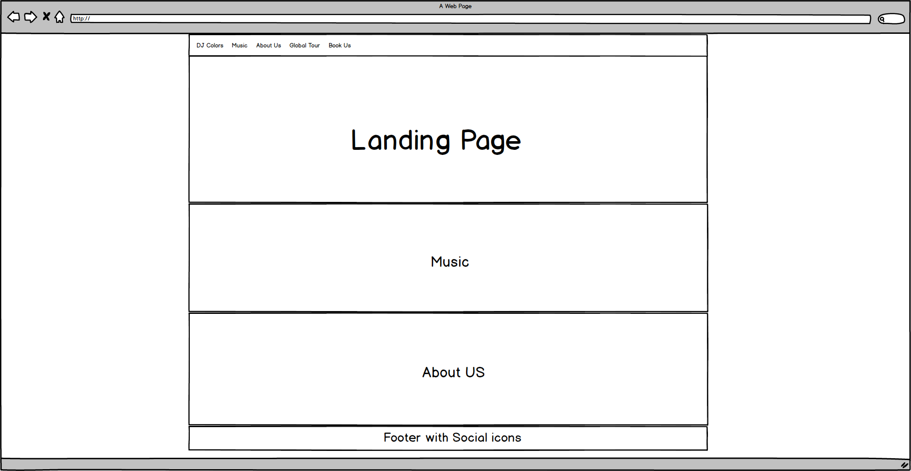

# DJ Colors
This website is for a well known DJ Group called Colors. They wanted a website that reflected their brand image, modern design with useful information.
# UX - Single Page
With that in mind, I decided to go with a responsive modern mobile-first approach, single page design. With a well-combined colour theme that reflected their image.

### Navbar
The navbar stays on top of the website at all times. Following the user, so they always can access the proper information they want. The design is responsive with soft animation to show the user which section they currently are at on the website.

On mobile devices, the navbar turns into a "hamburger" but with the same useful navigation and soft animations. There is a heartbeat animation effect on the collapse icon showing that the user can interact with it. This occurs at the beginning when the user is landing on the website.

The hamburger is closed when a link is clicked so that the content is always in front of the user.

### Landing Page
The user lands on a visually pleasing page with a slogan that is meant to wake curiosity to explore more. With a big arrow to point out that the user can continue exploring further down or go directly to DJ Colors social media. The social icons on the footer have a heartbeat animation effect to point it out at the beginning.
### Music
DJ Colors are well known worldwide and this section is just a handful of their top singles. It is meant for users to easily being able to listen and to decide if they want to continue on to their Spotify page.
### About Us
This section is a short story of how it all began. With a big picture album that will encourage the user to explore more about DJ Colors on their social media.
### Global Tour
Global Tour is a smooth popup that immediately presents the Global Tour information that the user wants. It is also showing a clip from youtube from their previous events. Promoting how exciting it is! There is a big "X" showing how the user can exit from the popup.
### Book Us
The User loves DJ Colors and really want to be able to book them for their own event! That is easily made by clicking "Book Us" that will present itself with a smooth popup and a form with just enough information that DJ Colors needs. A big "X" marks how the user can exit the popup.
### Footer
The footer acts the same way as the navbar. It is always following the user and it has smooth animations. It is basically a navbar for social media that makes it easy for the user to interact with DJ Colors.

## Technologies Used
* HTML
* CSS
* Javascript 
* Bootstrap 4

### Features

* Scrollspy is used from Bootstrap so the website can track where the user is at the webpage and highlight that on the navbar.
* Modals from the Bootstrap framework is used to present useful information to the user.
* The website is using "smooth-scroll" for a smooth visual pleasing UX. 
* The heartbeat animations at the beginning are implemented using animate.css

### Future Development
* Integration with Spotify API at the music section.
* Automated "Book Us" system.
* Webshop for buying Tickets to the Global Tour.
* Photo album in the "About Us" section using Instagram API

## Testing
I did some extensive testing of the website several times. I used Chrome Debugger. I tested the website in Chrome, Firefox, Safari and Edge. The hardware I tested on was PC, iPhone, Android Device and Mac.

In Chrome Debugger I used the responsive method to resize the window to see how everything looked. I also used it for checking how it would look on different mobile devices.

<b>Automated</b>

HTML: https://validator.w3.org/ 
CSS: https://autoprefixer.github.io/ and https://jigsaw.w3.org/css-validator/

<b>Manual Testing:</b>

<ol>
<li>Navbar
<ol type="I">
  <li>The Logo is working as a home button.</li>
  <li>The navbar is highlighting each section meaning that the scrollspy is working. </li>
  <li>The hamburger menu is working on mobile devices. The menu is collapsed after a link is clicked.</li>
</ol>
</li>
<li>Landing Page
<ol type="I">
    <li>The arrow link is working.</li>
    <li>The animations are working.</li>
</ol>
</li>
<li>Music
<ol type="I">
    <li>The HTML Audio controls are working.</li>
    <li>The link "Visit Spotify for more" is working.</li>
</ol>
</li>
<li>Abot Us: The photo album is working and the buttons for next and previous are working.</li>
</li>
<li>Global Tour: The smooth popup is working and it is showing the iFrame video from youtube.</li>
</li>
<li>Book Us: The form is correctly aligned and the required inputs are working. </li>
</li>
</ol>

### Known Bugs
When clicking on "Global Tour and Book Us" while the user is on the Landing Page the background image seems to be moving when the modal is being activated. This is because the background image is fixed and that there is no scroll in modal mode. 

This bug happens in Chrome and Firefox. 

<b>Possible solutions:</b>
* Change the background-attachment to scroll. Side effects: The visual effects of the overall design on the website is affected. 
* Disable scroll for the user on the single page. Side Effects: Poor UX.
* Enable scroll on the modal and set Body padding-right to 0 and !Important. Side effects: The social icons on the footer is getting padding from the modals, making them move. Scrolling is enabled on the website behind the modal.
* Adding custom javascript.

Read more: https://stackoverflow.com/questions/32675849/screen-zooms-in-when-a-bootstrap-modal-is-opened-on-ios-9-safari

### Performance
I optimized the images on the website for best performance. I measured the performance using the Chrome Debugger with network and the performance tab.

## Deployment
<b>I deployed this project by:</b>
<ol>
<li>Create a GIT folder in C9 Online IDE by typing "Git init"</li>
<li>Created the first version by adding files to "Git add"</li>
<li>Commited with message by "Git commit -m"</li>
<li>Create a repository on Github, named it and connected it to my git repository.</li>
<li>Pushed the project by using "Git Push"</li>
<li>Go to settings on Github and enable Github Pages and paste a link in the description.</li>
</ol>

Others that are interested in this project can make a copy of their own by downloading it or fork it on GitHub to make a copy to your own account. Import it to your IDE by using git clone https://github.com/tomost2019/dj-colors.git and run it. The code works without a proper IDE as well. Just open index.html.

## Credits
<b>Research:</b>

https://www.github.com 
https://stackoverflow.com 
https://www.css-tricks.com 
https://www.getbootstrap.com 
https://www.w3schools.com/

<b>Other:</b>

Code Institute

### Content
All content on this website is written by me.

### Media

Music: https://www.bensound.com/ 
Images: https://unsplash.com/ https://stock.adobe.com/ie/ 
Gifs: https://giphy.com/
### Acknowledgements

Animate CSS: https://daneden.github.io/animate.css/ 
Smooth-scroll: https://github.com/cferdinandi/smooth-scroll 
Fontawesome: https://www.fontawesome.com 
Flag-icons: https://cdnjs.com/libraries/flag-icon-css 
Favicon: https://gauger.io/fonticon/ 
Fonts: https://fonts.google.com/

## Remarks
This is my first milestone project and the group DJ Colors is not real. The stories and all the content, music and images has no connections. The project is a part of my portfolio. 

